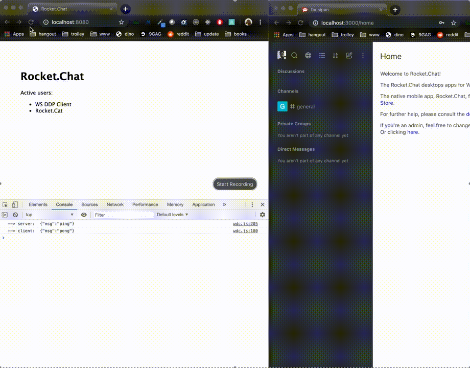

# WebSocket DDP Client

A demo for DDP Client using Websockets API



## Features
- Following [DDP Specification](https://github.com/meteor/meteor/blob/devel/packages/ddp/DDP.md).
- Using [WebSocket APIs](https://developer.mozilla.org/en-US/docs/Web/API/WebSocket) for communicating with a DDP Server.
- Implemention in pure JS, no extra libraries needed.

## DDP server provision
For this demo, I used [Rocket.Chat](https://github.com/RocketChat/Rocket.Chat) which contains a DDP Server. I created a user `wdc/secret` for authentication.


## Run
```bash
npm install
DEBUG=ws-ddp-client:* PORT=8080 npm start
```

## How to use
Have a look:
- Implementation: `public/javascripts/wdc.js`
- client code: `public/javascripts/index.js`


---
This project was bootstrapped with [express-generator](https://github.com/expressjs/express)

Inspired by https://github.com/hharnisc/node-ddp-client
